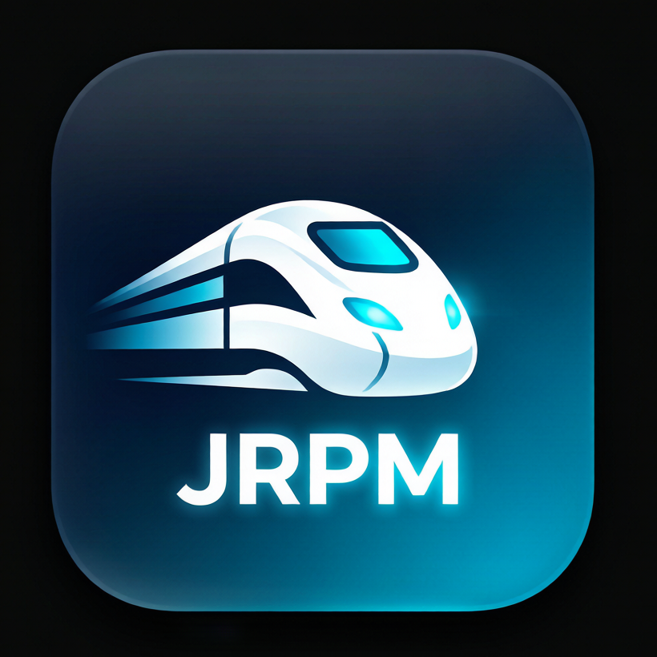

# 🚄 OpenTTD-JRPM

**A premium fork of JGR's Patchpack — merging pulsexlb, OpenTTD-modded and cmclient features, plus jrpm-specific additions.**

[English](README.md) · [简体中文](README_zh.md)

---

## ✨ About

OpenTTD-JRPM (jrpm) is a fork of [JGR's Patchpack](http://github.com/JGRennison/OpenTTD-patches),
additionally merging the **pulsexlb px-patch** features (train coupling/decoupling "loco swap" and
multi-tile modular airports), selected features from [OpenTTD-modded](https://github.com/embeddedt/OpenTTD-modded)
and [cmclient](https://github.com/citymania-org/cmclient), plus **jrpm-specific** additions (parallel
content download with multiple mirrors, automatic vehicle grouping by shared orders, a whole-game
perception AI API, and server-side multi-version client compatibility).

> **Version 0.1.0** — based on JGR's Patchpack 0.73.1 + pulsexlb px-patch.

---

## 📦 What's new in this version

Beyond the full JGRPP feature set (signal enhancements, scheduled dispatch, tracerestrict,
template replacement, realistic braking, one-way road upgrades, level-crossing safety, ...) and
the pulsexlb merge (loco decouple / modular multi-tile airports), this version adds:

<table>
<tr>
<th width="34%" align="center">🚂 From OpenTTD-modded</th>
<th width="33%" align="center">🎨 From cmclient (adapted)</th>
<th width="33%" align="center">⚡ jrpm-specific</th>
</tr>
<tr valign="top">
<td>
<ul>
<li><b>Trip history</b> — every vehicle remembers its last 10 trips (profit, occupancy, trip time). A History button shows per-trip profit, % change and summary stats.</li>
<li><b>Configurable plane taxi speed</b> — <code>vehicle.plane_taxi_speed</code> (1–8, default 4) tunes airport taxi speed independently.</li>
</ul>
</td>
<td>
<ul>
<li><b>Object-level build highlights</b> — live object preview for stations, tracks, depots, airports and industries.</li>
<li><b>Blueprint system</b> — <code>blueprint_copy</code> / <code>blueprint_build</code> across 16 in-memory slots with rotate/save/load.</li>
<li><b>Town zoning</b> — new "Town zones" (Tz0–Tz4) and "Town growth tiles" modes; persisted in a new <code>GRWT</code> savegame chunk.</li>
<li><b>Command record/replay</b> — <code>cmdrecord</code> + <code>cmdreplay</code> using jrpm's own command serialisation.</li>
<li><b>Multiplayer UI helpers</b> — viewport bookmarks, per-company cargo window, watch a company, console helpers.</li>
</ul>
</td>
<td>
<ul>
<li><b>Parallel content download</b> — multiple mirrors with configurable concurrency.</li>
<li><b>Automatic vehicle grouping</b> — by shared orders, via button or <code>autogroup</code>.</li>
<li><b>Whole-game perception AI</b> — <code>AIGlobal</code> API + GlobalAI example.</li>
<li><b>Multi-version clients</b> — server accepts jrpm / stock jgrpp / pulsexlb clients.</li>
</ul>
</td>
</tr>
</table>

---

## 🙏 Credits

jrpm would not exist without the work of these projects — many thanks to all of them:

| Project | What we borrowed |
|---|---|
| **[OpenTTD](https://github.com/OpenTTD/OpenTTD)** | The base game (GPL v2). |
| **[JGR's Patchpack](https://github.com/JGRennison/OpenTTD-patches)** | The foundation this fork is built on — signals, schedules, tracerestrict, … |
| **[pulsexlb/OpenTTD-patches (px-patch)](https://github.com/pulsexlb/OpenTTD-patches)** | Loco coupling/decoupling and modular multi-tile airports. |
| **[embeddedt/OpenTTD-modded](https://github.com/embeddedt/OpenTTD-modded)** | Trip history and configurable plane taxi speed. |
| **[citymania-org/cmclient](https://github.com/citymania-org/cmclient)** | Object highlights, blueprint, town zoning, command record/replay, multiplayer UI helpers. |

---

## 📜 License & notes

This is a collection of features and other modifications applied to [OpenTTD](http://www.openttd.org/).
It's a separate version of the game which can be installed and played alongside the standard game,
not a loadable mod (NewGRF, script, or so on). It is mainly intended for players who are already
familiar with the standard game; some features and settings target very experienced players and may
have a steep learning curve.

Released under the **GNU General Public License v2.0** — see [COPYING.md](COPYING.md).

🚄 Made with care by the jrpm maintainer · <a href="https://maicarons.github.io/jrpm/">Read the full documentation →</a>

